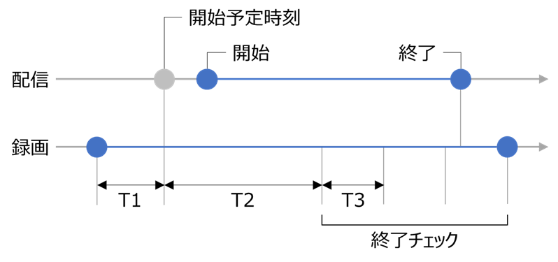

[English](README.md) | [日本語](README.ja.md)

***本リポジトリは [UnarchivedStreamDownloader](../../../UnarchivedStreamDownloader) に移動しました。***

# Unarchived Stream Recorder

YouTube 生配信を録画するツール。

> [!WARNING]
> 本ツールの利用は法律、及びYouTubeの利用規約に抵触する恐れがあります。  
> 本ツールの利用によって生じたいかなる損失や損害についても、当方は一切の責任を負いません。

## 概要

指定されたチャンネルの配信をチェックし、タイトルに指定のキーワードが含まれている場合、  
配信開始予定時刻まで待機し、OBSを使用してその配信を録画します。

## 使い方

OBS と `UnarchivedStreamRecorder.dll.config` ファイルを設定した後、ツールを実行します。

### OBS の設定

#### OBS Websocket サーバーの設定

1. OBSを起動し、`ツール(T)` メニューの `WebSocket サーバー設定` を選択します。
2. `WebSocket サーバー設定` ウィンドウで、次のオプションを設定します。
   - `WebSocketサーバーを有効にする` - チェックボックスをオンにします。
   - `サーバーポート` - 必要に応じて、WebSocketサーバーのポート番号を指定します。
   - `サーバーパスワード` - 必要に応じて、WebSocketサーバーのパスワードを指定します。
3. `OK` ボタンをクリックし、設定を保存します。

#### 解像度の設定

1. `ファイル(F)` メニューの `設定(S)` を選択します。
2. `設定` ウィンドウの `映像` タブで、次のオプションを設定します。
   - `基本 (キャンバス) 解像度` - `1920x1080` に設定します。
   - `出力 (スケーリング) 解像度` - `1920x1080` に設定します。
3. `OK` ボタンをクリックし、設定を保存します。

#### 音声の設定

OBSのメインウィンドウで、`音声ミキサー` の `デスクトップ音声` をミュートにします。

### `UnarchivedStreamRecorder.dll.config` ファイルの設定

環境に合わせて `UnarchivedStreamRecorder.dll.config` ファイルを設定します。

#### YouTube の設定

- `YouTube.APIKey` - YouTube Data APIキーを指定します。
- `ChannelIDs` - 録画対象とするチャンネルのIDをカンマ区切りで指定します。
- `Keywords` - 録画対象とする配信タイトルに含まれるキーワードをカンマ区切りで指定します。

```xml
<add key="YouTube.APIKey" value="" />
<add key="ChannelIDs" value="" />
<add key="Keywords" value="unarchive, no archive" />
```

#### OBS の設定

- `OBS.FilePath` - OBSのファイルパスを指定します。
- `OBS.URL` - OBS WebsocketサーバーのURLを指定します。
- `OBS.Password` - OBS Websocketサーバーのパスワードを指定します。
- `OBS.SceneName` - OBSでの録画時に作成するシーン名を指定します。既存のシーン名と重複しないように注意してください。
- `OBS.SourceName` - OBSでの録画時に作成するソース名を指定します。特に理由がない場合、デフォルトのままとしてください。

```xml
<add key="OBS.FilePath" value="C:\Program Files\OBS-Studio\bin\64bit\obs64.exe" />
<add key="OBS.URL" value="ws://127.0.0.1:4455" />
<add key="OBS.Password" value="" />
<add key="OBS.SceneName" value="StreamRecorder" />
<add key="OBS.SourceName" value="Browser" />
```

#### 時間の設定

- `StartBufferMinutes` (T1) - 配信開始予定時刻に対する予備録画時間(分)を指定します。
- `SkipEndCheckMinutes` (T2) - 録画開始後に配信の終了チェックをスキップする時間(分)を指定します。
- `CheckPollingMinutes` (T3) - 配信の終了をチェックする間隔(分)を指定します。

```xml
<add key="StartBufferMinutes" value="1" />
<add key="SkipEndCheckMinutes" value="30" />
<add key="CheckPollingMinutes" value="1" />
```



## ライセンス

このソフトウェアは[Unlicense](LICENSE)に基づいてライセンスされています。
