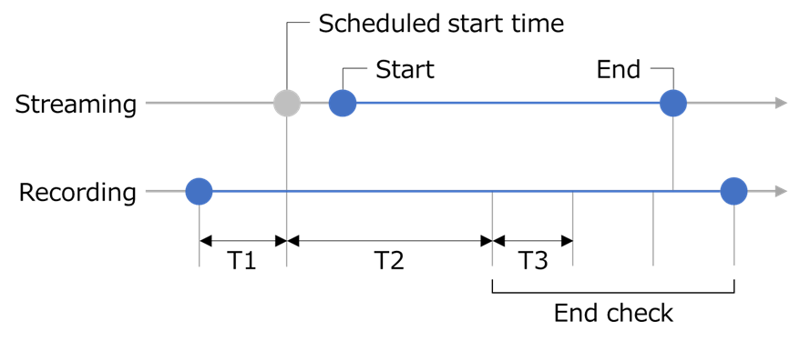

[English](README.md) | [日本語](README.ja.md)

***This repository will be moved to [UnarchivedStreamDownloader](../../../UnarchivedStreamDownloader).***

# Unarchived Stream Recorder

A tool for recording YouTube live streams.

> [!WARNING]
> The use of this tool may violate the law and YouTube's Terms of Service.  
> I will not be held responsible for any losses or damages caused by the use of this tool.

## Overview

Check the specified channel's stream, and if the title contains the specified keyword,  
wait until the scheduled start time of the stream and use OBS to record it.

## Usage

After setting up OBS and the `UnarchivedStreamRecorder.dll.config` file, run the tool.

### Setting Up OBS

#### OBS Websocket Server Settings

1. Launch OBS, go to the `Tools` menu, and select `WebSocket Server Settings`.
2. In the `WebSocket Server Settings` window, configure the following options:
   - `Enable WebSocket server` - Check the box to enable the WebSocket server.
   - `Server Port` - Set the port number for the WebSocket server, if needed.
   - `Server Password` - Set a password for the WebSocket server, if needed.
3. Click the `OK` button to save the changes.

#### Resolution Settings

1. Go to the `File` menu, and select `Settings`.
2. Go to the `Video` tab in the `Settings` window, configure the following options:
   - `Base (Canvas) Resolution` - Set to `1920x1080`.
   - `Output (Scaled) Resolution` - Set to `1920x1080`.
3. Click the `OK` button to save the changes.

#### Audio Settings

In the OBS main window, mute the `Desktop Audio` in the `Audio Mixer`.

### Setting Up `UnarchivedStreamRecorder.dll.config` File

Setting up the `UnarchivedStreamRecorder.dll.config` file to match your environment.

#### YouTube Settings

- `YouTube.APIKey` - Set the YouTube Data API key.
- `ChannelIDs` - Set the channel ID(s) separated by commas to be recorded.
- `Keywords` - Set the keyword(s) separated by commas contained in the streaming title to be recorded.

```xml
<add key="YouTube.APIKey" value="" />
<add key="ChannelIDs" value="" />
<add key="Keywords" value="unarchive, no archive" />
```

#### OBS Settings

- `OBS.FilePath` - Set the OBS file path.
- `OBS.URL` - Set the OBS Websocket server URL.
- `OBS.Password` - Set the OBS Websocket server password.
- `OBS.SceneName` - Set the scene name to be created for the recording in OBS. Ensure that it does not duplicate existing scene names.
- `OBS.SourceName` - Set the source name to be created for the recording in OBS. If there is no reason, leave it as the default.

```xml
<add key="OBS.FilePath" value="C:\Program Files\OBS-Studio\bin\64bit\obs64.exe" />
<add key="OBS.URL" value="ws://127.0.0.1:4455" />
<add key="OBS.Password" value="" />
<add key="OBS.SceneName" value="StreamRecorder" />
<add key="OBS.SourceName" value="Browser" />
```

#### Time Settings

- `StartBufferMinutes` (T1) - Set the buffer recording time(in minutes) before the scheduled start time of the stream.
- `SkipEndCheckMinutes` (T2) - Set the time(in minutes) to skip the end check after starting the recording.
- `CheckPollingMinutes` (T3) - Set the polling interval(in minutes) to check for the end of the stream.

```xml
<add key="StartBufferMinutes" value="1" />
<add key="SkipEndCheckMinutes" value="30" />
<add key="CheckPollingMinutes" value="1" />
```



## License

This software is licensed under the [Unlicense](LICENSE).
